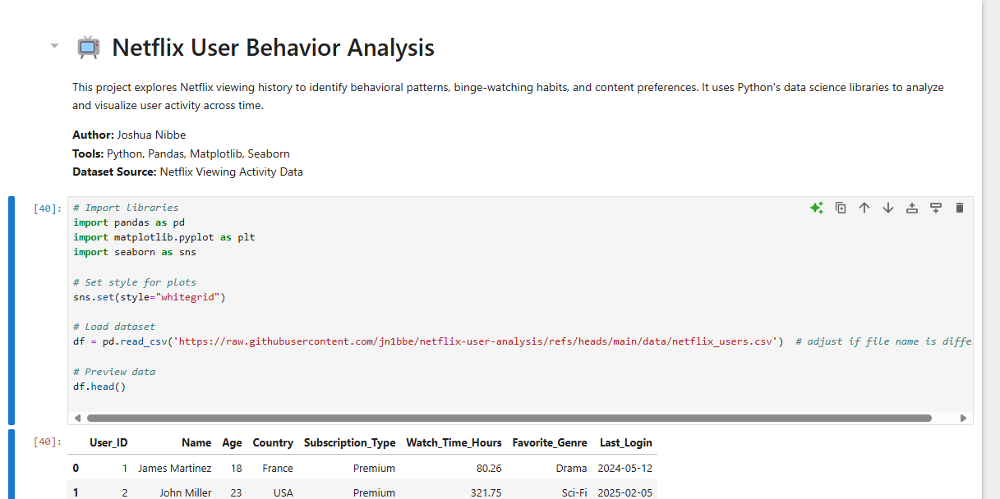

# 📊 Netflix User Behavior Analysis

This project analyzes behavioral trends from a Netflix user dataset, focusing on how age, subscription type, favorite genres, and login times relate to content engagement. The dataset contains anonymized user profiles, including information such as watch time, preferred genres, and country of origin.

---

## 🎯 Objectives

- Identify the most popular genres among users
- Compare average watch time across subscription types
- Reveal which days users are most active
- Explore regional genre preferences

---

## 🧪 Methods & Tools

- **Python** for scripting and analysis  
- **Pandas** for data manipulation  
- **Matplotlib & Seaborn** for visualization  
- **Jupyter Notebook** for documenting the workflow

---

## 🔍 Key Findings

- **Horror** and **Documentary** were the most commonly selected favorite genres.
- Users with **Basic** subscriptions recorded higher average watch time.
- Most logins occurred on **Friday**, revealing peak streaming behavior.
- Genre preferences showed **regional variation**, highlighting cultural trends.

---

## 📓 View the Notebook

You can view the analysis notebook directly on GitHub:

👉 [Netflix_Analysis.ipynb on GitHub](https://github.com/jn1bbe/netflix-user-analysis/blob/main/notebooks/Netflix_Analysis.ipynb)
---

## 🖼️ Preview

---

## 🔮 Future Enhancements

- Add timestamp-level viewing data for binge detection
- Build a genre-based content recommendation engine
- Cluster users by region, age, and preferences

---

> ✍️ **Author:** Joshua Nibbe  
> 📁 Project Folder: `/Netflix_User_Analysis`
